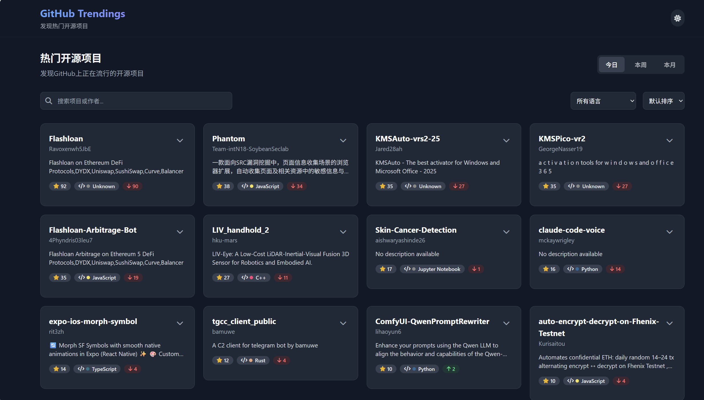
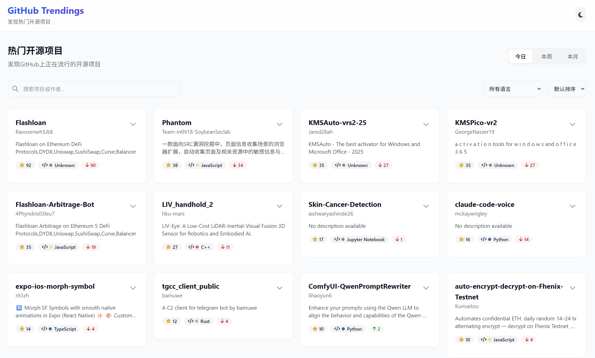

# GitHub Trendings 可视化

一个优雅的GitHub趋势项目可视化网站，帮助开发者发现和分析热门开源项目。




## ✨ 功能特点

- 📊 **多维度趋势查看** - 支持按日、周、月查看GitHub热门项目
- 🔍 **高级搜索与筛选** - 可按语言、星标数、增长率等条件筛选项目
- 📈 **数据可视化** - 通过直观图表展示项目趋势变化
- 🌓 **深色/浅色模式** - 自动跟随系统设置或手动切换
- 📱 **响应式设计** - 完美适配桌面端与移动端
- 💾 **本地存储** - 保存用户偏好设置与浏览历史
- 🔄 **智能缓存** - 优化API请求，提升性能并避免请求限制

## 🚀 快速开始

### 前提条件

- Node.js 16.x 或更高版本
- npm 或 yarn 包管理器

### 安装步骤

1. 克隆本仓库
```bash
git clone https://github.com/yourusername/github-trendings-visualization.git
cd github-trendings-visualization
```

2. 安装依赖
```bash
npm install
# 或
yarn install
```

3. 启动开发服务器
```bash
npm run dev
# 或
yarn dev
```

4. 在浏览器中访问 `http://localhost:3000`

## ⚙️ 部署指南

### 构建生产版本

```bash
npm run build
# 或
yarn build
```

构建产物将生成在 `dist` 目录中。

### 部署选项

#### Vercel (推荐)

1. 将项目推送到GitHub仓库
2. 在Vercel中导入项目
3. 配置构建设置:
   - 构建命令: `npm run build`
   - 输出目录: `dist`

#### Netlify

1. 将项目推送到GitHub仓库
2. 在Netlify中导入项目
3. 配置构建设置:
   - 构建命令: `npm run build`
   - 发布目录: `dist`

#### 自托管

将 `dist` 目录中的文件部署到任何静态文件服务器，如Nginx、Apache等。

## 🔧 技术栈

- **前端框架**: React 18+
- **语言**: TypeScript
- **构建工具**: Vite
- **样式**: Tailwind CSS
- **图表**: Recharts
- **API**: GitHub API
- **状态管理**: React Context API
- **本地存储**: localStorage API

## 📝 使用说明

### 浏览趋势项目

1. 在首页默认显示今日热门项目
2. 使用顶部时间筛选器切换"今日"、"本周"或"本月"趋势
3. 点击项目卡片可直接跳转到GitHub仓库页面
4. 展开项目卡片可查看星标趋势图表

### 搜索与筛选

1. 使用搜索框搜索特定项目或作者
2. 通过语言筛选器选择特定编程语言
3. 使用排序选项按星标数、增长率或名称排序
4. 点击"清除筛选"重置所有过滤条件

### 个性化设置

1. 点击右上角月亮/太阳图标切换深色/浅色模式
2. 系统会自动保存您的偏好设置

## 🤝 贡献指南

1. Fork 本仓库
2. 创建特性分支 (`git checkout -b feature/amazing-feature`)
3. 提交更改 (`git commit -m 'Add some amazing feature'`)
4. 推送到分支 (`git push origin feature/amazing-feature`)
5. 打开Pull Request

## 📄 许可证

本项目采用MIT许可证 - 详见 [LICENSE](LICENSE) 文件。

## 🙏 鸣谢

- [GitHub API](https://docs.github.com/en/rest) - 提供趋势数据
- [React](https://reactjs.org/) - 前端UI库
- [Tailwind CSS](https://tailwindcss.com/) - CSS框架
- [Recharts](https://recharts.org/) - 数据可视化库

---

© {new Date().getFullYear()} GitHub Trendings 可视化. 保留所有权利。